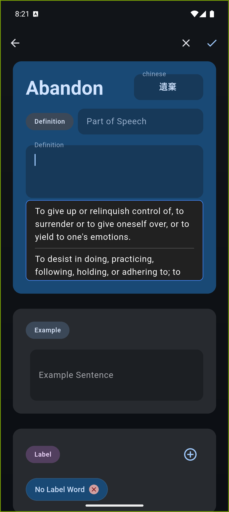
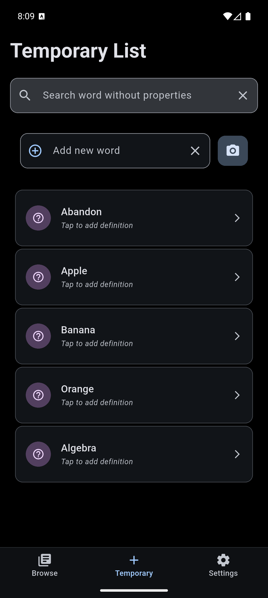
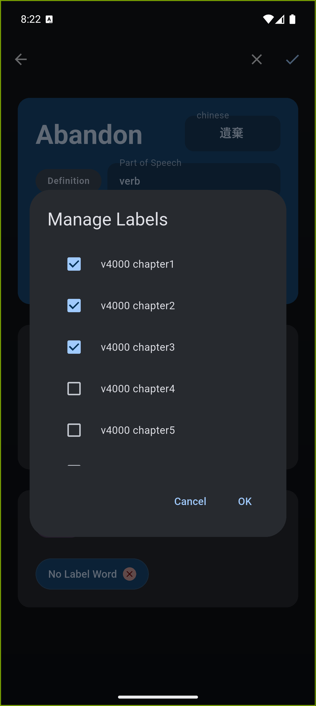
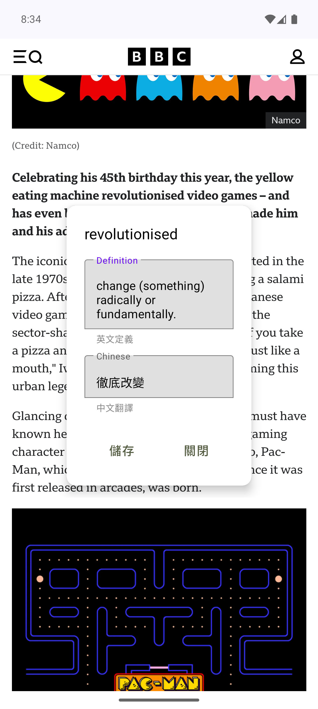
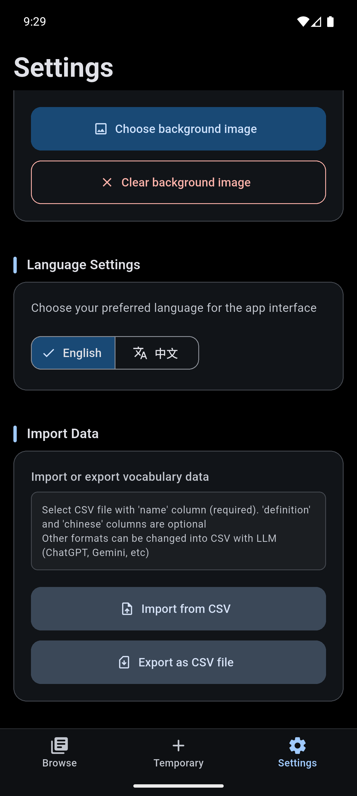
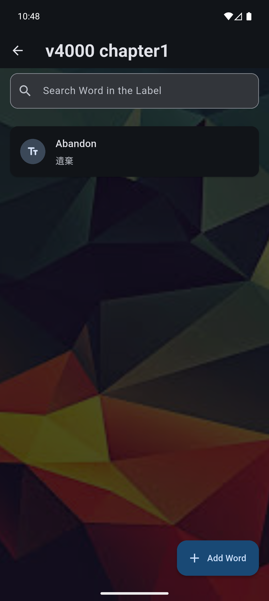

# VocabDB

A personal vocabulary management app built with Flutter, designed for English learners who want to build, organize, and review their own vocabulary database. Words can be stored with rich details, grouped by custom labels, and exported/imported via CSV for flexible data management.

---

## Features

- **Add & manage words** — Store each word with its definition, part of speech, Chinese translation, and example sentences
- **Custom labels** — Organize words into categories for structured review
- **Temporary word bank** — Quickly capture new words without definitions; fill in details later
- **Full-text search** — Search across all words and labels instantly
- **CSV import & export** — Import vocabulary from spreadsheets or export selected labels for external use
- **Receive shared text** — Share text from any Android/iOS app directly into the word bank
- **Dictionary API** — Fetch definitions, parts of speech, and example sentences automatically
- **Custom background** — Set a personal background image for the app
- **Bilingual UI** — Full English and Traditional Chinese localization

---

## Screenshots

<table>
  <tr>
    <td align="center">
      
       
      Dictionary lookup
    </td>
    <td align="center">
      
       
      Temporary word bank
    </td>
    <td align="center">
      
       
      Add labels
    </td>
  </tr>
  <tr>
    <td align="center">
      
       
      Receive shared text
    </td>
    <td align="center">
      
       
      Quick copy actions
    </td>
    <td align="center">
      
       
      Custom background
    </td>
  </tr>
</table>

---

## Tech Stack

| Area | Technology |
|------|-----------|
| Framework | Flutter (Dart) |
| State Management | Riverpod + code generation |
| Local Database | SQLite via `sqflite` |
